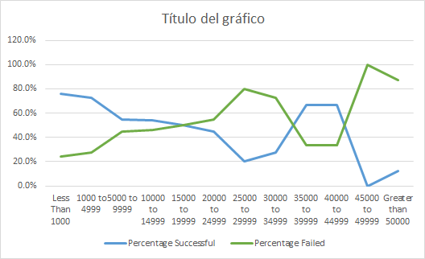
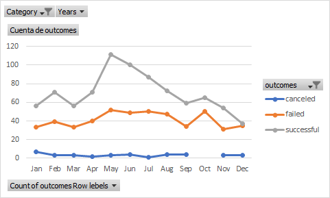

# Kickstarting with Excel

## Overview of Project

- Analysis to see when is the best moment to do a campain.

### Purpose

-Analysis to see when is the best moment to do a campain.

## Analysis and Challenges

-The tabular data is well organaised but I did some changes to the format.
-Formulas were incorrect I fixed it by cheking the functions.

### Analysis of Outcomes Based on Launch Date

-The probability of getting the budget is a little more than 50%

### Analysis of Outcomes Based on Goals

### Challenges and Difficulties Encountered

-Problems whith the formulas.

## Results

- What are two conclusions you can draw about the Outcomes based on Launch Date?
- The best month to do a capaing

- What can you conclude about the Outcomes based on Goals?

- What are some limitations of this dataset?

- What are some other possible tables and/or graphs that we could create?
